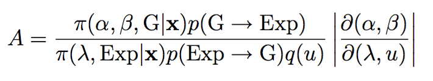
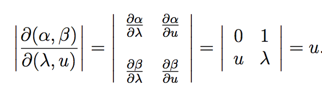
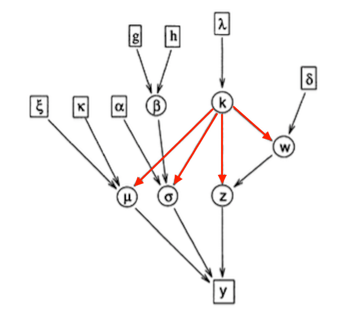
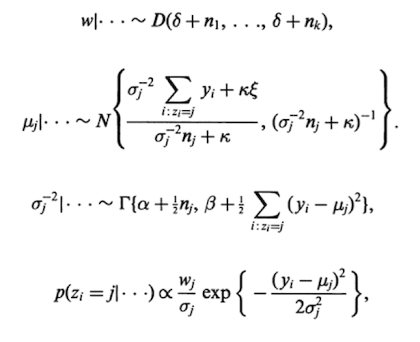
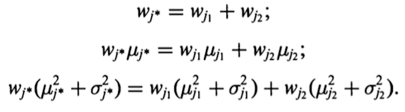
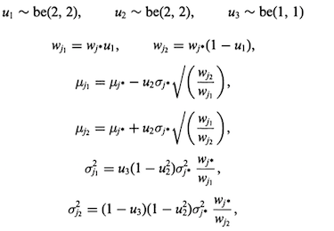
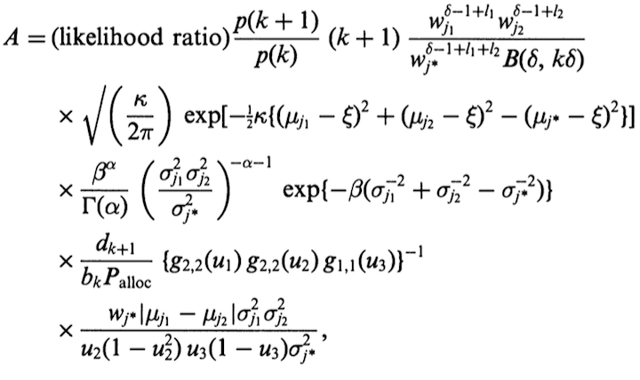

Some examples of RJ-MCMC
========================================================
author: 
date: 3/29/2016

Model Selection with RJ-MCMC
===
(This was largely expanded from notes from [Pierre Jacob](https://sites.google.com/site/pierrejacob/) at Harvard)

- $\left(\mathcal{M}_{m}\right)_{m\in\mathbb{N}}$: a collection of models
- $\theta_{m}\in \mathcal{H}_m$: associated model parameter and space
- $\mathcal{H} = \bigcup_{m\in\mathbb{N}}\{\mathcal{M}_{m}\}\times \mathcal{H}_m$: full parameter space

Some distributions we can choose: 
- $p(\theta_{m}\mid\mathcal{M}_{m})$: prior distribution
- $p\left(Y\mid\theta_{m},\mathcal{M}_{m}\right)$: likelihood
- $p\left(\mathcal{M}_{m}\right)$: prior on models

What we hope to target
===
The two posterior distributions.

The easy one:

$$
\pi\left(\theta_{m}\mid \mathcal{M}_{m}, Y\right) \propto p\left(Y \mid \theta_{m},\mathcal{M}_{m}\right)p\left(\theta_{m}\mid\mathcal{M}_{m}\right)
$$

The hard one:

$$
\pi\left(\mathcal{M}_{m},\theta_{m}\mid Y\right) \propto p\left(Y \mid \theta_{m},\mathcal{M}_{m}\right)p\left(\theta_{m}\mid\mathcal{M}_{m}\right)p\left(\mathcal{M}_{m}\right)
$$

We'll ignore the first one for today, we've seen lots of methods for this already. Also, denote the second posterior as:
$$\pi\left(m,\theta_{m}\right)$$

Between-Model Moves:
===
$(m,\theta_{m})\in \mathcal{H}$
- So far $\mathcal{H}_m$ is unrestricted (can have differing number of parameters) 
- MCMC chain we create for this pair will be moving in $\mathcal{H}$

Consider proposals of the form:
$$
q(m\to m^{\prime})q_{m\to m^{\prime}}(\theta\to\theta^{\prime})d\theta^{\prime}
$$

1. propose changing models: $q(m\to m^{\prime})$
2. propose the parameters in the new model: $\theta^{\prime}\in\mathcal{H}_{m^{\prime}}$

Dimension matching
===
Propose $m^{\prime}$ from $q(m\to m^{\prime})$ 

$\theta$ and $\ \theta^{\prime}$ can be of different dimensions, use auxillary variables to match the dimensions
$$dim\left((\theta,u)\right) = dim\left((\theta^{\prime},u^{\prime})\right)$$

- If increasing dimensionality, then $u'$ could be empty
- If decreasing dimensionality, then $u$ could be empty

Overall idea is then to transform old variables $(\theta,u)$ into new variables $(\theta^{\prime},u^{\prime})$

Transformations
===

Auxillary variables are used to match dimensions, we can draw them from arbitraty distributions
$$
u \sim \varphi_{m\to m^{\prime}}(\cdot) \ \text{and} \  u' \sim\varphi_{m^{\prime}\to m}(\cdot), 
$$

Recall acceptence probability. It involved a derivative of this transformation. So choose a nice one!
$$
(\theta^{\prime},u^{\prime})=G_{m\to m^{\prime}}(\theta,u)
$$

For example (Diffeomorphism):
- differentiable in all coordinates
- invertible
- inverse also differentiable

Acceptence Probability
===
$$
\min\left(1,\frac{\pi(m^{\prime},\theta^{\prime})q(m^{\prime}\to m\text{)}\varphi_{m^{\prime}\to m}(u^{\prime})}{\pi(m,\theta)q(m\to m^{\prime})\varphi_{m\to m^{\prime}}(u)}\left\vert \frac{\partial G_{m\to m^{\prime}}(\theta,u)}{\partial(\theta,u)}\right\vert \right)
$$

This is just the regular old Hastings acceptence probability but 

- with a slightly more complex two-stage proposal
  - propose a new model: $m \to m^{\prime}$
  - propose a way of mapping: $\mathcal{H}_m \to \mathcal{H}_{m^{\prime}}$
- with a Jacobian to adjust for the change of parameter space

Things to consider
===

More things will play a role in the efficiency of this algorithm than in other MCMC methods
- How you choose to transform your parameters, ie. choosing $G_{m\to m^{\prime}}$
- How you propose changing models $\ q(m\to m^{\prime})$
- How you select auxillary variable $\ \varphi_{m\to m^{\prime}}(u)$

A concrete example 
===
Want to fit the data $(y_1, ..., y_n)$ to one of two models, either 
$$
y_i \sim Exp(\lambda)\\
y_i \sim Gamma(\alpha, \beta)
$$
Let's be Bayesian: 
$$
\lambda \sim Gamma(a_1, b_1)\\ \alpha \sim Gamma(a_2, b_2)\\ \beta \sim Gamma(a_3, b_3)
$$

We can also put priors on our models:
- $p(Exp)$: prior belief that Exponential is the correct model
- $p(G)$: prior belief that Gamma is the correct model

Deriving some samplers within models
===

We want to sample from $\pi(m, \theta_m)$, where

$m\in\{1, 2\} = \{Exp, Gamma\}$, 

$\theta_1 = \lambda, \theta_2 = (\alpha, \beta)$

Between models samplers 
===

First direction: $\ q(Exp \to Gamma)$

- Current state: $\theta = \lambda$
- Auxillary variable: $u \sim Gamma(\gamma, \delta)$
- Transformation:
$$
(\alpha, \beta) = G_{1\to 2}(\lambda, u) = (u, \lambda u)
$$
- Acceptence probability: $min(1, A)$

Between models samplers 
===

Jacobian:

If we force alternating between models and equal model priors.

$$
A = \frac{L_{G}(x|\alpha, \beta)p(\alpha)}{L_{Exp}(x|\lambda)p(\lambda)q(u)}u
$$

Between models samplers 
===
The other direction
- Transformation:
$$
(\lambda, u) = G_{2 \to 1}(\alpha, \beta) = G^{-1}_{1 \to 2}(\alpha, \beta)  = (\alpha, \alpha/\beta)
$$
- Accptence Probability:
$$
min(1, A^{-1})
$$

What Did I learn? Tl;Dr
=== 

- Making reversible jump MCMC moves is tedious work in complex models.
- Creating moves that are both reversible **and** efficient seems to be a challenge.
- Being able to do full Bayesian inference is a **big upside**
- Some unsolicited advice:
  - Diffeomorphisms come in handy here, re: Jacobian
  - Thinking of concrete examples makes these ideas clearer

===

Mixture Models (Basic Formulation)
========================================================

We can generally write:
$$
y_i \sim \sum_{j = 1}^k w_j \ f(\cdot\ |\  \theta_j)
$$

Generative-model formulation is for each observation:

- First draw a group indicator $z_i \in \{1, ..., k\}$  with probabilities $\{w_j\}_{j = 1}^k$
- Then draw a value of $\ \ y_i|z_i = j \sim f(\cdot\ |\  \theta_j)$

How Reversible Jump MCMC could play a role here is when the number of components $\ k$ is unknown.

 
Mixture Models (Basic Formulation)
========================================================
- $p(k)$: number of mixture components
- $p(w\ |\ k)$: mixture weights given the components
- $p(z\ |\ w, k)$: group indicators given number and weight of components
- $p(\theta\ |\ z, w, k)$: the distribution of parameters given (...)
- $p(y\ |\ \theta, z, w, k)$: the distribution of data given (...)

The full Bayesian model as a generative hierarchy:

$$
p(y, \theta, z, w, k) = p(k)p(w\ |\ k)p(z\ |\ w, k)p(\theta\ |\ z, w, k)p(y\ |\ \theta, z, w, k)
$$

Dependency DAG
=====

 

-  dimensional dependence (as well as statistical)

Decompose the Bayesian model
====
(for posterior sampling (using Sneaky Bayes Rule))

$$
\begin{align}
p(\theta, z, w, k\ |\ y) & \\
&= p(w\ |\  z, \theta, k, y) p(\theta, z, k \ |\ y)\\
&= p(\theta\ |\  z, w, k, y) p(z,w, k \ |\ y)\\
&= p(z\ |\  \theta, w, k, y) p(\theta,w, k \ |\ y)\\
&= p(k\ |\  z, w, \theta, y) p(\theta, z,w \ |\ y)\\
\end{align}
$$

We cycle through these equalities to end up with Gibbs Samplers... but not for everything. 

Let's find out why. Together.

Mixture Models (Traditional MCMC?)
========================================================

If we assume a Normal $f(\cdot\ |\  \theta_j)$, then $\theta_j = (\mu_j, \sigma_j)$, we can put conjugate priors on these. 

$$\mu_j\sim N(\xi, \kappa), \sigma_j^2 \sim gamma^{-1}(\alpha, \beta)$$

We can also put priors on the things that depend on $k$:

$$w = (w_1, ..., w_k)\sim Dir(\delta, \delta, ..., \delta)$$

Again, some of these moves can be done with traditional MCMC, like Gibbs (a nice example was posted on [Piazza](http://sites.stat.psu.edu/~dhunter/515/hw/MCMCexample.pdf), Thanks Elena!). 

Mixture Models (Traditional MCMC!)
=====

$n_j = \#\{z_i = j\}$. These are the posteriors for fixed $k$

 

Parameters with varying dimension
=====

(Death to Traditional MCMC): 
Some of the parameters change dimensions
$$
|\theta| = 2^k\\
|w| = k\\
z_i \in \{1, ..., k\}
$$
 
RJ-MCMC for the win
===

- we need to make moves that account for this strange dimensional dependence on $k$
- these moves should be reversible, i.e. the map $\ q_m(x, dx')$ that moves between dimensions should be reversible.
- One way to guarantee this is to enforce a [diffeomorphism](https://en.wikipedia.org/wiki/Diffeomorphism) of the mapping, more on this. 

Between-dimension moves
===
Richardson and Green (1997) propose the following pairs of moves for sampling $k$:

1. Splitting one mixture component up into two, or combining two into one
2. the birth or death of an empty component
  - I'm going to happily skip this.

Split-Combine Move
===
- Either split one or combine two with prob: $(b_k, 1-b_k)$
- **Combine** (call new group $\ j^*$)
  - Find the "closest" compponents, $j_1, j_2$
  - Set all $z_i = j_1\ or\ j_2$ equal to $\ j^*$

  - Proposal: append parameters with $(k + 1, w_{j^*}, \mu_{j^*}, \sigma_{j^*})$
  - This is a one-to-one mapping (a diffeomorphism in fact).

Split-Combine Move
===
- **Split**
  - Randomly select a $\ j^*$
  - Do the inverse of the combine split

  - Proposal: append parameters these things
  - a non-random selection here may improve efficiency (?)

Acceptence Probability
===
For the Split Move $\alpha = min(1, A)$

For the combine move it's $\alpha = min(1, A^{-1})$, with the "obvious substitutions" o_0. See Richardson and Green (1997).

