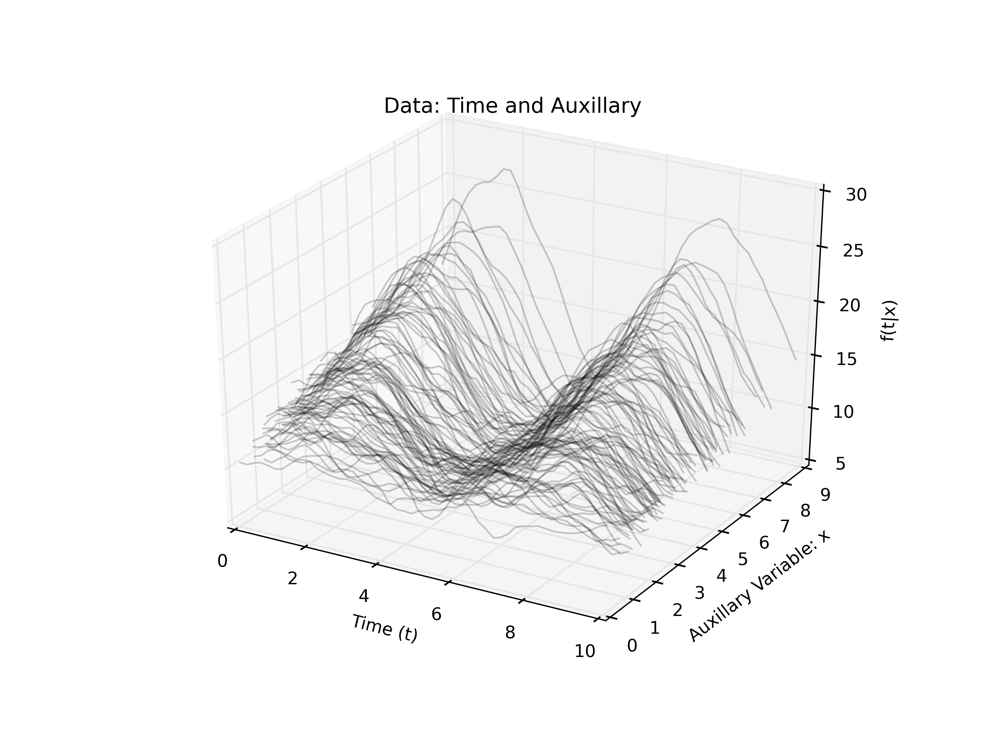
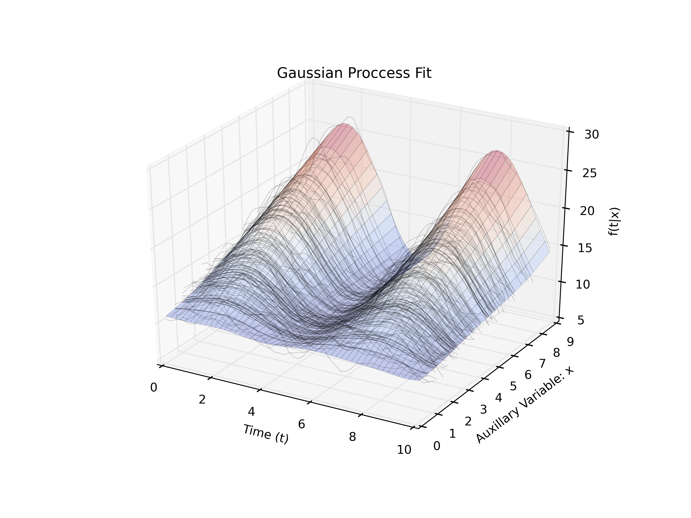
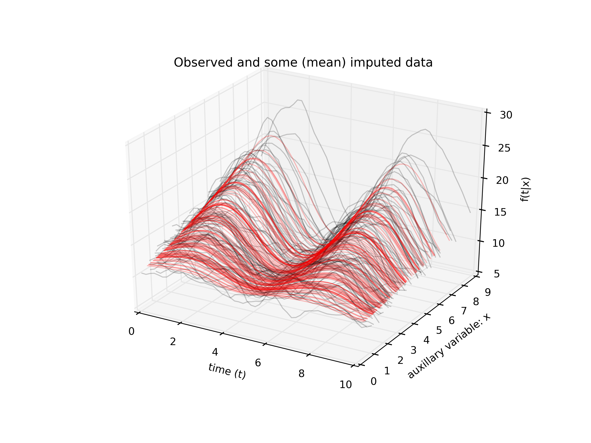
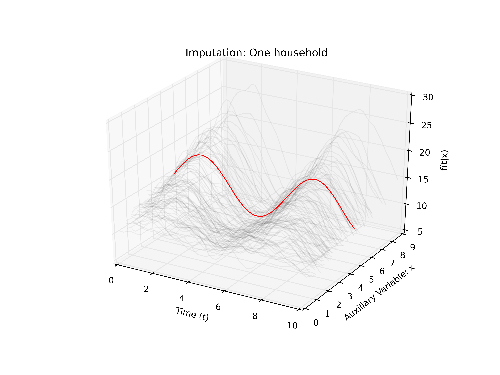
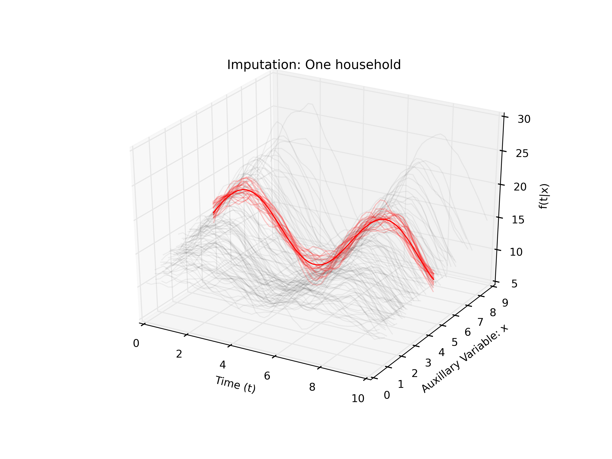

(Bayesian) Modeling of Functional Data in Survey Sampling
========================================================
author: Luis Campos (with Luke Miratrix)
date: 4/19/2016
transition-speed: fast 

Motivation
========================================================
 
**Electricity consumption over time**
- Electric companies supply **a large number** $(N)$ of households with electricity
- Automated sensors provide **detailed measurements** of usage over time $\ f_i(t)$ (e.g. 30 sec. grid)
- Would like to **estimate of the average or overall** electricity use as a function of time, $\ \mu(t)$ or $\ N\mu(t)$
 
Motivation
========================================================
 
**Storage and transmission** of this data starts becoming an issue
- Generally the company **does not have detailed usage** $\ f_i(t)$
  + The sensors are attached to people's homes
- Transmitting and storing all this data could get out of hand
  + remeber: time grid
- But **total usage** $(x_i)$ is either automatically or manually gathered  for billing $(!)$
  + This will prove useful later on
 

Motivation
========================================================

**Some requirements**:
  - Need good estimates of average
  - Sample should be useful for more than just $\mu(t)$ 
    + ($)
    + e.g. mean estimate of high-volume users

**Summary**:
  - Lots of data from a known **population**
  - Can't **afford** to **sample** all of them
  - One strategy that may be effective: **sampling**
  

Functional Data in Survey Sampling
========================================================
incremental: true

- **Population of units**
  + households, *sampling frame*: $i \in \{1, ..., N\}$
  + sensor measurements: $\ f_i(t), t = t_1, ..., t_T$ 
  + assume same time grid
- Population **quantity of interest**, e.g. $\ \mu(t) = \frac{1}{N}\sum_{i = 1}^N f_i(t)$

- One question: **How do we estimate** $\ \mu(t)$ from a sample?
  - Some solutions: Simple average, Horvitz-Thompson Estimate, Hajek (Ratio) Estimator, Model-assisted estimators, Model-based estimators... Will depend on how we sample.
  
 
Sampling Choices
========================================================
**Sampling indicator** $\ S_i$ and **selection probability** $\ \pi_i$
 
1. **Bernoulli Sampling**: $\ \pi_i = n/N$ and $\ S_i \stackrel{ind}{\sim} Bern (\pi_i)$
2. **Simple Random Sampling**: slightly more complicated, i.e. dependend, but possible
3. **Poisson Sampling**, using auxiliary information: 
  - $\pi_i \propto x_i$
  - $S_i \stackrel{ind}{\sim} Bern (\pi_i)$

- There are many other options.
- We're going to use **Poisson sampling**, more on this later.

Estimates of population means
========================================================

*Sample average* $(S)$, *Horvitz-Thompson* $(HT)$, *Hajek* $(H)$: for $\ t$
<small>
$$
\begin{align}
&\widehat\mu_{S}(t) = \frac{1}{n}\sum_{i = 1}^N S_i\  f_i(t),& &\widehat\mu_{HT}(t)= \frac{1}{N}\sum_{i = 1}^N\frac{S_i}{\pi_i} f_i(t)\\
&\widehat\mu_{H}(t) = \frac{1}{\widehat N}\sum_{i = 1}^N\frac{S_i}{\pi_i} f_i(t),& & \widehat N = \sum_{i = 1}^N\frac{S_i}{\pi_i}
\end{align}
$$ 
</small>

$\widehat N$ is called the **sample weight**
- $\mathbb{E}[\widehat N] = N$, $\ \ H$ is a stable version of $HT$

**Cardot, Goga, Lardin [2013a, b, 2014, 2015]** - Asymptotics, properties, cool data, and more estimators.

Simulation
========================================================
Previous month's everage usage $\ (x_i)$, current usage $(\ f_i(t))$.
$i \in \{1, ..., N\}$, $t \in \{t_1, ..., t_T\}$

**Population**:
$$
\begin{align}
&x_i \sim Gamma(2)\\
&f_i(t) \sim 10 + x_i(1 + sin(x_i)) +  \varepsilon_i(t) \\
&[\varepsilon_i(t_1), ..., \varepsilon_i(t_T)]  \sim N_T({\bf{0}}, K) \\
&(K)_{kl} = exp(-(t_k - t_l)^2/2)
\end{align}
$$ 

**Sampling Mechanism** - Poisson Sampling:

$$
\begin{align}
\pi_i = 100\frac{x_i}{\sum_{i = 1}^N x_i},\ \  S_i \stackrel{ind}{\sim} Bern(\pi_i),\ \  n = \sum_{i = 1}^N S_i,\ \  \mathbb{E}(n) = 100
\end{align}
$$ 

Simulation
========
</img>
 
A sample and some estimates
====== 

</img>  

Comparison of Estimates
=====
Root Mean Squared Error:

$$
Err(\widehat{\mu}_{*}, {\mu}) = \left(\frac{1}{T}\sum_{t = t_1}^{t_T}\left(\widehat{\mu}_{*}(t) - {\mu}(t)\right)^2 \right)^{1/2}
$$

How did the Estimators do? 

For this example, the RMSEs are:

Estimate | Error|
---------| ----|
Simple Estimate |1.759|
H-T Estimate |0.309|
Hajek Estimate |0.229|

A quick simulation study
==================================================

**Given the population, repeat 1,000 times**:
- Take a sample: $\ S_i\sim Bern(\pi_i)$
- Calculate estimators: $\ \widehat{\mu}_{*}(t)$
- Calculate errors: $Err(\widehat{\mu}_{*}, {\mu})$

**Simulation Results**:

Error of Estimates:

Estimate | Mean| SD| min| max
---------| ----|---|---|---
Simple Average	 |1.48 |	0.22 |	0.59 |	2.35
H-T Estimate |	1.25 |	0.97 |	0.07 |	9.16
Hajek Estimate	 |0.26 |	0.15 |	0.06	 |1.33

A quick simulation study
==================================================
</img> 

Confidence Bands
========================================================
 
Covariance between $\hat\mu_{HT}(r)$ and $\hat\mu_{HT}(t)$:

$$
\gamma_{HT}(r, t) = \frac{1}{N^2}\left[\sum_{i\in U}\frac{(1-\pi_i)}{\pi_i}  f_i(r)\ f_i(t)\right]
$$
 
An estimate (**H-T**-ification)

$$
\widehat\gamma_{HT}(r, t) = \frac{1}{N^2}\left[\sum_{i\in U} \color{red}{\frac{S_i}{\pi_i} }\frac{(1-\pi_i)}{\pi_i}  f_i(r)\ f_i(t)\right]
$$

- $\widehat\gamma_{H}(r, t)$ is similar, but more complex

Confidence Bands
========================================================
incremental: true

**Simulation based inference**: Gelman and Hill (Ch. 7, 8), Cardot 2013a.

1. **Sample** $J$ times from
$$
\mu_j^*(t) \sim GP(\hat\mu_{HT}(t), \Sigma),\ \ \  (\Sigma)_{ik} = \widehat\gamma_{HT}(t_i, t_k)\\
$$
2. **Take quantiles** of $\{\mu_j^*(t)\}$ for each $\ t = t_1, ..., t_T$

- We share information across $t$
- Simple to implement $(GP := N_T)$

Confidence Bands
========================================================

</img> 

Weighted Estimators: Generally
========================================================
incremental: true
 
Consider the following:
<small>
- $\pi_1 = 1$, this household is always selected
- $\pi_{153} = 1/2$, this household selected half the time
- $\pi_{42} = 1/100$, this household is rarely selected
</small>

**One interpretation** for weights:
<small>
- $1/\pi_{1} = 1 = 1 + 0$
- $1/\pi_{153} = 2 = 1 + 1$
- $1/\pi_{42} = 100 = 1 + 99$
</small>

**We can write**: $1/\pi_i= 1 + (1/\pi_i - 1)$ 

**Why this interpretation?** $\ \mathbb{E}\left(\sum_{i = 1}^N\frac{S_i}{\pi_i}\right) = N$

Weighted Estimators
========================================================
incremental: true

Continuing this logic
 
$$
\begin{align}
&\mu(t) = \frac{1}{N} \sum_{i = 1}^N f_i(t) =   \frac{1}{N} \left(\sum_{i \in {\bf{S}}} f_i(t) + \color{red}{ \sum_{i \notin {\bf{S}}} f_i(t) }\right)\\
\end{align}
$$

$$
\begin{align}
\hat\mu_H(t) &=  \frac{1}{N} \sum_{i = 1}^N \frac{S_i}{\pi_i} \ f_i(t)\\
&=\frac{1}{N} \left(\sum_{i \in {\bf{S}}} f_i(t) + \color{red}{ \sum_{i \in {\bf{S}}} \left(\frac{1}{\pi_i} - 1\right)\ f_i(t)}\right)
\end{align}
$$

1. We **are modeling** the unobserved population quantities
2. We **could model** better

Making a case for modeling
========================================================
incremental: true
 
Why model? 
 - Even simple modeling has been shown to outperform weighting 
  + Little et.al. (2013, 2015) - penalized splines to model univariate outcomes
  + Si, Pillai, Gelman (2015) - GP to model univariate outcomes
 - Models are easily **extendable**. Estimators maybe not.
 - Modern computation allows for **sophisticated modeling**
 - $\pi_i$ may not mean what we think it means
 - incorporate **prior information** *
 - **stability of estimates** *

 
Making a case for modeling
========================================================
incremental: true
What Model? GP is **natural model** for functional data.

Model $\ f_i(t)$ as a function of time and the **auxiliary variable** $x_i$

$$
\begin{align*}
f_i(t) = f(t, x_i) &\sim GP(\nu(t, x_i), K)\\
K\left((t, x), (t', x')\right) &= \sigma_1^2 exp\left(-\frac{(t - t')^2}{l_1^2} -\frac{(x - x')^2}{l_2^2}\right)\\ 
&+\  \sigma_2^2 \delta_{x = x'} exp\left(-\frac{(t - t')^2}{l_3^2}\right) + \sigma_3^2  \delta_{x = x',\ t = t'}
\end{align*}
$$

Notation
========================================================

\[ X_{obs} = \left( \begin{array}{cc}
t_1 & x_1 \\
\vdots & \vdots\\
t_T & x_1 \\
\vdots & \vdots\\
t_1 & x_n \\
\vdots & \vdots\\
t_T & x_n  \end{array} \right), 

Y_{obs} = \left( \begin{array}{c}
f_1(t_1) \\
\vdots\\
f_1(t_T) \\
\vdots\\
f_n(t_1) \\
\vdots\\
f_n(t_T)  \end{array} \right)

\] 

We can similarly define $X_{*}$, the locations of **unobserved** function values and $Y_{*}$ the unobserved function values.

We can model the **unobserved outcomes**.

Predictive distribution
=========
incremental: true

Lifted straight out of Rasmussen & Williams (R&W 2006)

$$ 
\begin{align*}
&Y_{*}|X_{obs}, Y_{obs}, X_{*} \sim N(\nu^*, \Sigma^*)\\
&\nu^* = K(X_{*}, X_{obs})\left[K(X_{obs}, X_{obs}) + \sigma^2 I\right]^{-1}Y_{obs}\\
&\Sigma^* = K(X_{*}, X_{obs}) + \sigma^2 I \\
&\ \ \ \ \ + K(X_{*}, X_{obs})\left[K(X_{obs}, X_{obs}) + \sigma^2 I\right]^{-1}K(X_{obs}, X_{*})
\end{align*}
$$
Predictive distribution
=========

**Challenges**:
- For $\ n = 100$, $\ X_{obs}$ has $\ 5100$ rows. 
- Imputation dataset, $\ N-n = 900$, is **very big**.

**Solutions**:
- Fit with Sparse-GP (Hensman, et.al. 2013, CH 8 R&W 2006)
  + select $\ m$ inducing points (anchor points)
  + replace: $\ K_{N'N'} \approx K_{N'm}K_{mm}^{-1}K_{mN'}$ (Nyström approx.)
- Impute in chunks (more on this later)

========================================================

</img>
   

========================================================

</img>

 
Mean Estimator: using GP model
========================================================
Simple construction of average estimate 

+ $\nu^*$ is **mean estimate** of unobserved household estimates 
+ $\nu^* = \{\widehat f_i(t)\}_{i \notin S}$

$$\widehat \mu_{GP}(t) = \frac{1}{N}  \left(\sum_{i \in {\bf{S}}} f_i(t) + \sum_{i \notin {\bf{S}}} \widehat f_i(t) \right)$$

========================================================

</img>

========================================================
 
</img>

Confidence Bands with GP model
========================================================
incremental: true

Our model can quantify many levels of uncertainty

$$Y_{*}|X_{obs}, Y_{obs}, X_{*} \sim N(\nu^*, \Sigma^*)$$

+ We can predict the values of unobserved households, not just their predicted means: 
$$Y_{*} = \{\widetilde f_i(t)\}_{i \notin S}$$
+ As before, **simulation-based inference** gives idea of **uncertainty**
+ How are these predictions shaped for a given household?

========================================================
</img>

========================================================
</img>

Confidence Bands with GP model
========================================================
incremental: true

`1.` **Repeat** the following  $\ J$ times

- Sample a **prediction** surface

$$
Y_{*}^j\ |\ X_{obs}, Y_{obs}, X_{*} \sim N(\mu^*, \Sigma^*)
$$

- Use $\ Y_{*}^j = \{\widetilde f_i^{\ j}(t)\}_{i \notin S}$,  $\ Y_{obs} = \{f_i(t)\}_{i \in S}$ to calculate

$$\widehat \mu_{GP}^{\ j}(t) = \frac{1}{N}  \left(\sum_{i \in {\bf{S}}} f_i(t) + \sum_{i \notin {\bf{S}}} \widetilde f_i^{\ j}(t) \right)$$

`2.`Calculate **confidence band with quantiles** of $\ \{\widehat\mu^{\ j}_{GP}(t)\}$

 

========================================================

</img>

Concluding Remarks
========================================================
incremental: true 
- We introduced an **interesting example** of the use of sampling methods
- We reviewed some **sampling methods** (many more to be investigated)
  + We considered some classics (weighted estimators)
- We argued for **modeling instead of weighting**
  + Found out modeling can be hard
  + But sometimes worth it
- **Lots more to do**:
  + Inference properties, comparison with other model-assisted estimators
  + Many remaining computational issues

========================================================
<big>Thanks!</big>

References
============
<small>
- Cardot, H., Degras, D., & Josserand, E. (2013a). **Confidence bands for Horvitz–Thompson estimators using sampled noisy functional data**. Bernoulli, 19(5A), 2067–2097.
- Cardot, H., Goga, C., & Lardin, P. (2014). **Variance Estimation and Asymptotic Confidence Bands for the Mean Estimator of Sampled Functional Data with High Entropy Unequal Probability Sampling Designs**. Scandinavian Journal of Statistics, 41(2), 516–534.
- Si, Y., Pillai, N. S., & Gelman, A. **Bayesian Nonparametric Weighted Sampling Inference**. Bayesian Analysis (2015) 10, Number 3, pp. 605–625
</small>  

More References
============
<small>
- Wood, J. (2008). On the covariance between related Horvitz-Thompson estimators. Journal of Official Statistics, 24(1), 53.
- Yates, F., & Grundy, P. M. (1953). Selection Without Replacement from Within Strata with Probability Proportional to Size. Journal of the Royal Statistical Society., 15(1), 253–261.
- Zheng, H., & Little, R. J. A. (2013). Inference for the Population Total from Probability-Proportional-to-Size Samples Based on Predictions from a Penalized Spline Nonparametric Model.
- Comments on: An Evaluation of Model-Dependent and Probability-Sampling Inferences in Sample Surveys (1983) - Rubin, D. B,  Little, R. J. A
</small>

