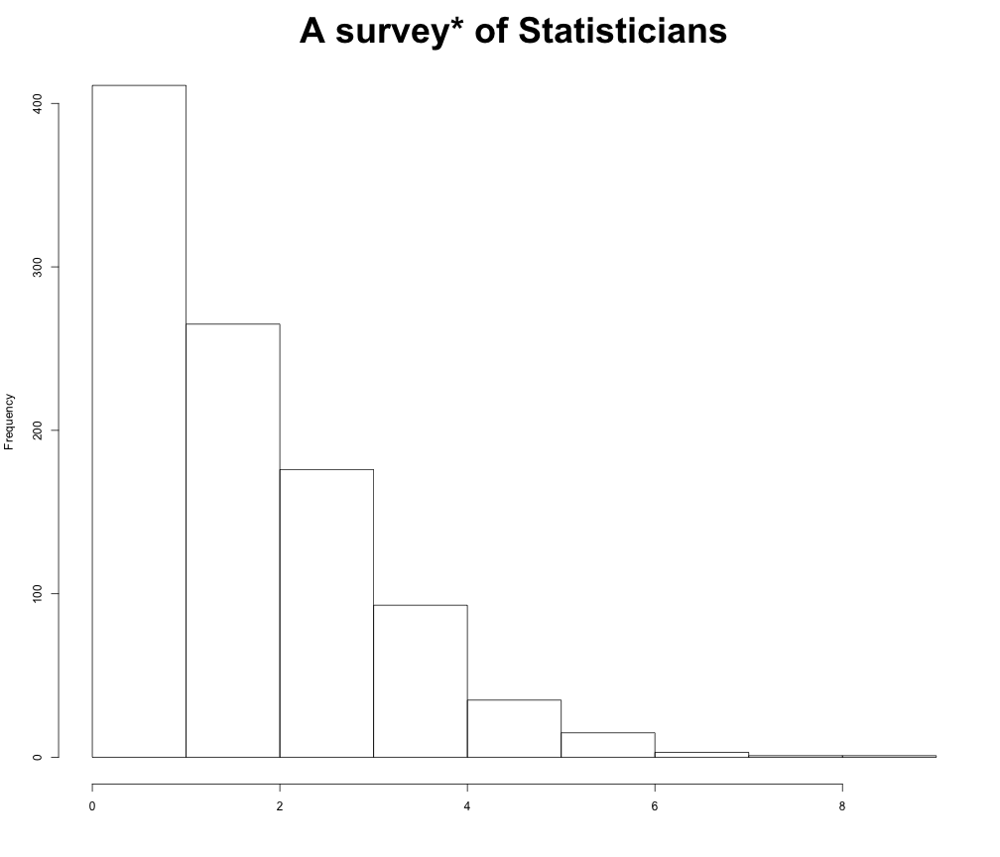
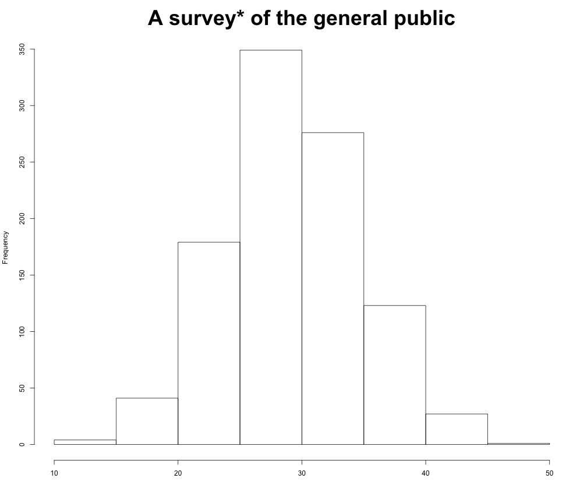
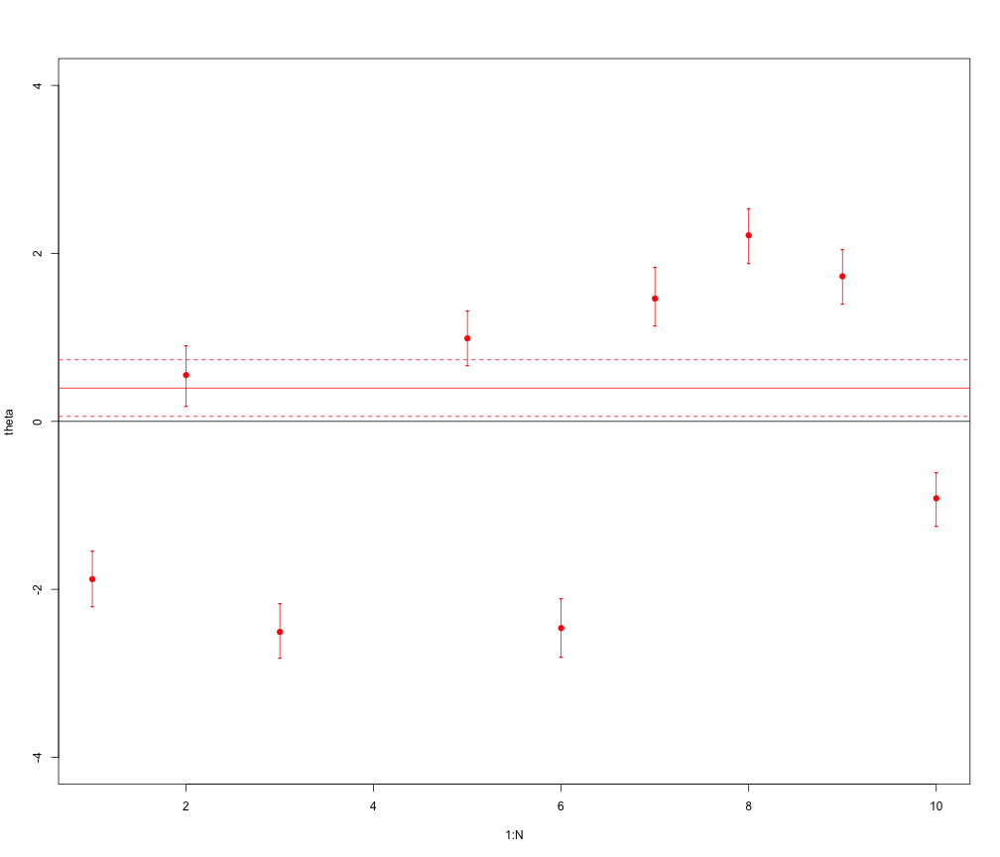
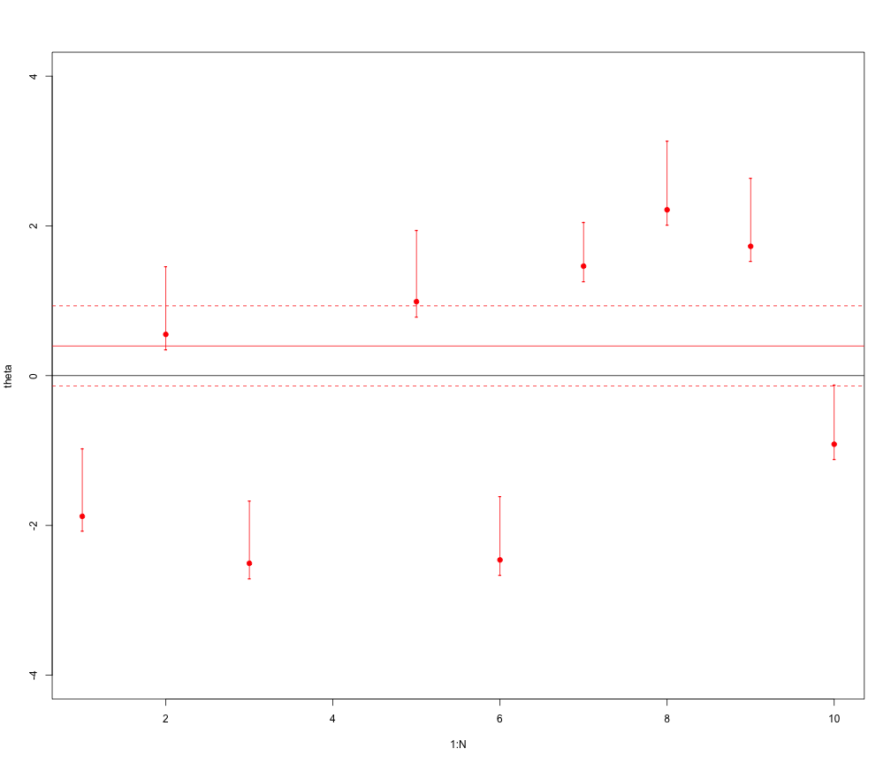
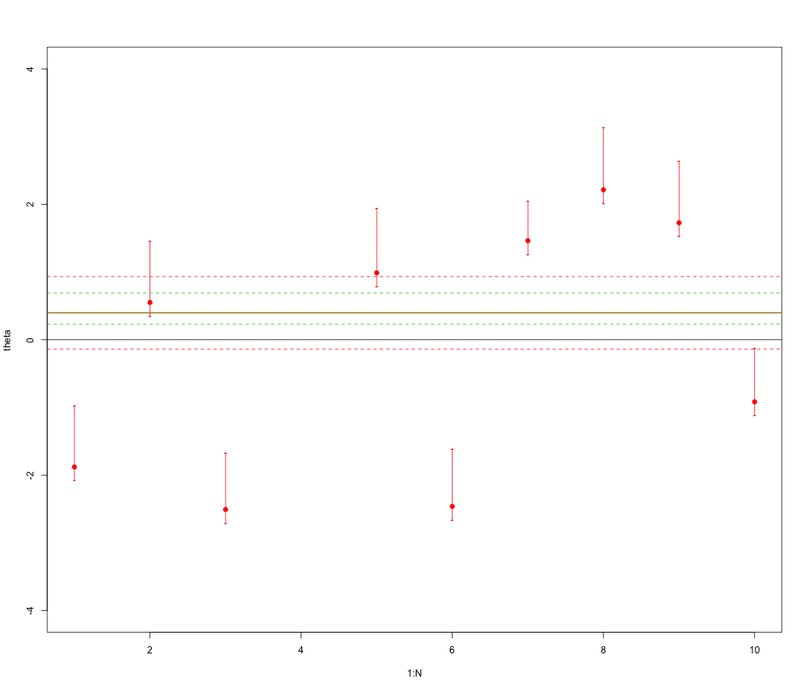
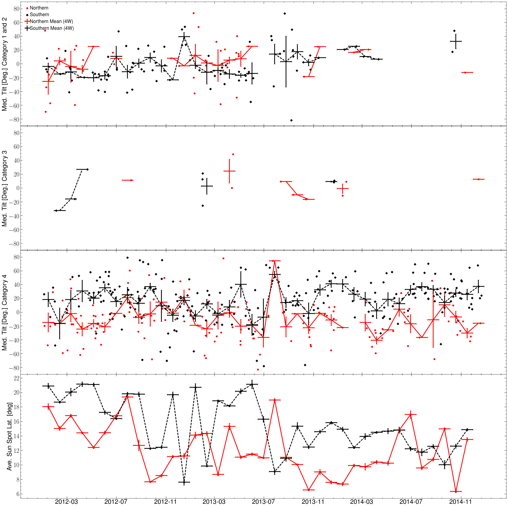
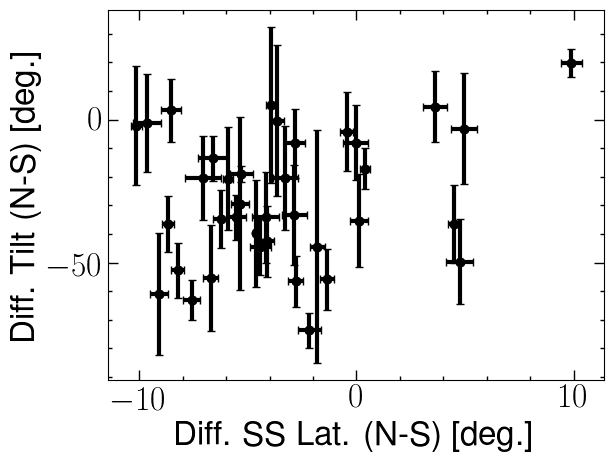

Ask a Statistician
========================================================
author: Katy McKeough & Luis Campos
date: 12/12/2017
autosize: true

Some Caveats
========================================================
incremental: true
- We don't know everything
- We're _just_ grad students
- Statistics can be a contrvercial field, these are our opinions -- loosely based in reality. 
- We hope this stimulates furher questions and discussion

How may statisticiants does it take...
========================================================
incremental: true

to change a lightulb? 

How may statisticiants does it take...
========================================================
to change a lightulb? 

*Simulated for purposes of humor

Error Propogation
========================================================

"Often the upper and lower errors of a best fit parameter are different. In this case I take a mean value to propagate errors. How bad/good is this practice?"

Error Propogation
========================================================

Error Propogation
========================================================

Solar Time Series Correlation
========================================================
We are comparing time series solar observations to find long term trends. Currently, we take a 28 day mean to compare between observations (e.g. compare emerging flux and filament tilt). The comparison indicates a few possible correlated features by eye. However, we cannot confirm the correlation by standard regression techniques because outside the features the time series observations show significant noise. Therefore, we have two questions. 

- First, are running means the best way to correlate time series observations or do more advanced statistical techniques exist? 
- Second, is there statistical way to match features across different time series observations when the noise is large?

Solar Time Series Correlation
========================================================

Solar Time Series Correlation
========================================================

Lomb-Scargle Periodogram (or similar analysis) to constrain proposed models. So, you want to be Bayesian.
========================================================

- We see no significant evidence of signals in the Lomb-Scargle Periodogram.  
- There are some models of universe expansion that predict some sort of oscillatory signals (though not generally pure sine modes), modulated by various parameters. 
- We would like to say something along the lines of: "given this model with these free parameters, our analysis shows that values of the parameters outside of this range are ruled out with such and such certainty.""

Explaining Shrinkage
========================================================

Your data looks like this:
$$X_{ij} \sim N (\mu_{i}, 1)$$
for $i = 1, ..., k$ and $j = 1, ...n$

- We know that a good estimate of $\mu_{i}$ is the MLE $$\bar{X}_i = \frac{1}{n} \sum_{j = 1}^n X_{ij}$$
- Turns out, an "overall" better estimate when $k>2$ is 
$$ \mu_i = \left(1 - \frac{n(k-2)}{\sum_{i = 1}^k \bar{X}_i^2}\right)\bar{X}_i$$

A Visualization
========================================================

$$	
(\bar{X}_1, \bar{X}_2, \bar{X}_3) \sim N((\mu_1,\mu_2,\mu_3), I_3/n)
$$

We consider two estimators of the vector $(\mu,\mu,\mu)$ for this visualization:

- Mean: $X$
- James-Stein: $JS = (1-\frac{k-2}{||X||^2})X$

 
 
Detection significance
========================================================

- Assume there exists a very wide field X-ray telescope with 2 x 10^6 cells of position.
- The background level in each cell is 4.2 x 10^-4 counts/sec, Poisson distributed. 
- An X-ray source appears in only a single cell.
- Its strength is S1. 
- How long an exposure is needed to be have 99.9% confidence that the source exists?

Discussion Topics:

- Scenario 1: If we know which cell the source is in.
- Scenario 2: We don't know.
- Multiple Hypothesis Testing
- Correlated Hypotheses -- Modeling?

====

